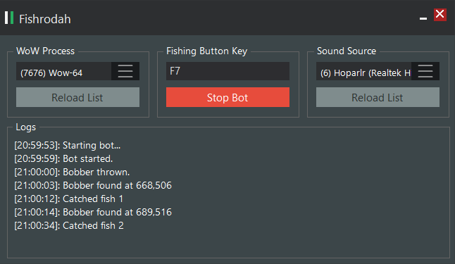

# Fishrodah
###### Yet another fishbot for World of Warcraft

Fishrodah is another fishing bot for World of Warcraft. It uses unique methods to catch fish. It neither injects dll nor changes anything on memory. Fishrodah uses image processing to find the fishing bobber. It simply searches bobber image (bobber.png) on screen. It also sound processing to determine correct timing to click the bobber. It just listens your sound card output (does not records anything) and fires an event when fishing sound found. To make Fishrodah work, WoW window must be visible and there must not any sound or music playing in background. The only sound source must be WoW. 

## Support
- World of Warcraft Legion (7.1.5)
- and probably any other expansions too... I didn't tested others yet.

## Usage
- Mute music and environment sound in-game
- Find a silent fishing spot (really, any kind of noise affects the performance of bot)
- Select WoW process from list
- Set fishing button key
- Click "Start Bot"

**Note that**, depending on your fishing location, you may need to replace bobber.png with your own screenshot.
